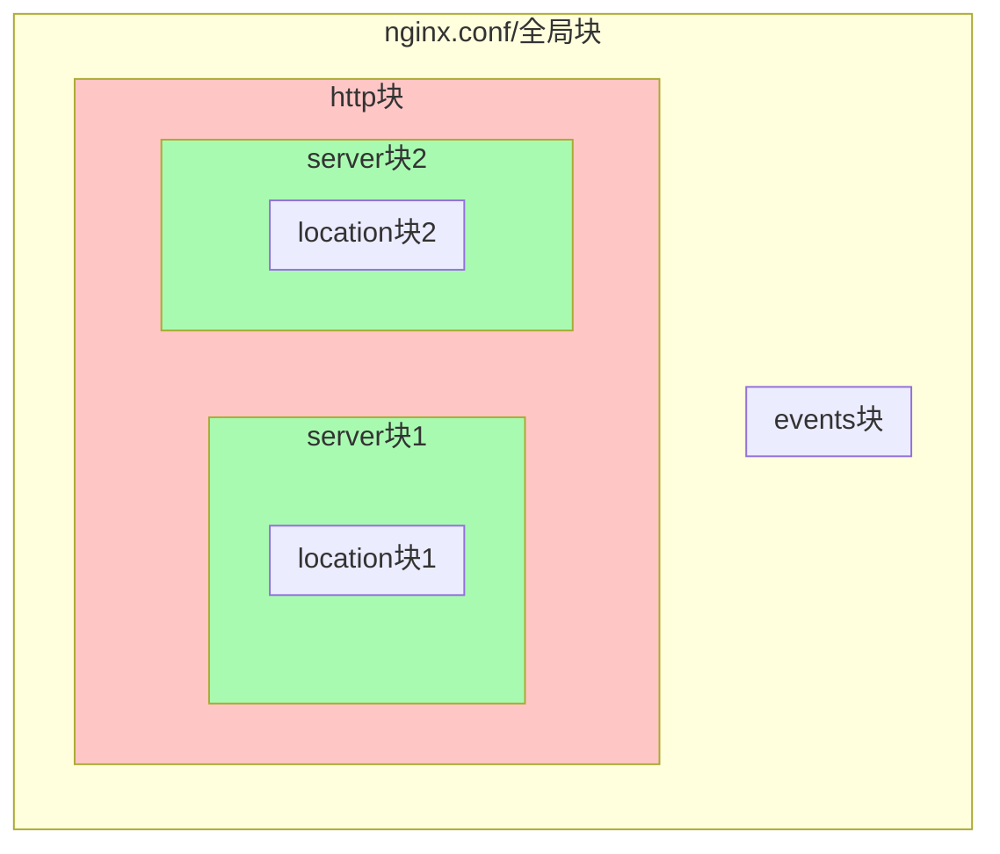
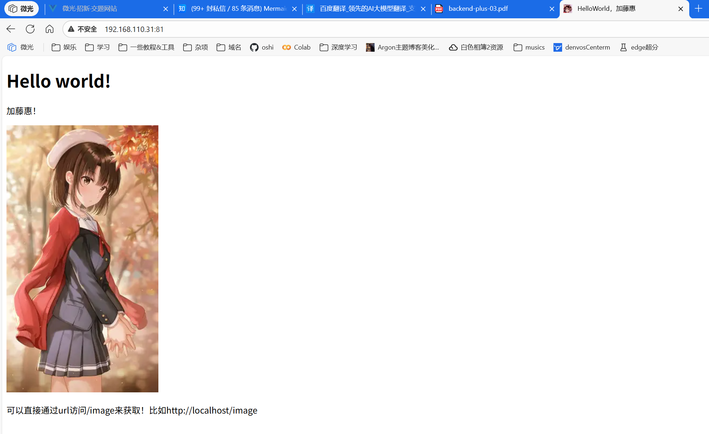

## Task1

Q：安装Nginx

A：这里直接使用回答后端附加题1时使用的Ubuntu来进行操作。直接使用包管理器（`sudo apt install nginx -y`）安装Nginx。

查看安装的Nginx的版本：
```bash
~$ nginx -v
nginx version: nginx/1.24.0 (Ubuntu)
```
直接访问`192.168.110.43`（我的Ubuntu的地址是这个）：


Q：简单了解⼀下Nginx的⽬录结构。
```bash
/etc/nginx/
├──conf.d   //虚拟主机配置
├──modules-available
├──modules-enabled   //启用的模块配置
├──sites-available   //可用站点配置
├──sites-enabled   //启用的站点配置
├──snippets   //可复用的配置片段
├──fastcgi.conf
├──fastcgi_params   //FastCGI参数
├──koi-utf
├──koi-win
├──mime.types   //定义MIME类型
├──nginx.conf   //配置文件
├──proxy_params   //代理参数
├──scgi_params
├──uwsgi_params
└──win-utf

/var/log/nginx   //日志文件目录
/var/www/html   //html静态资源目录
/usr/share/nginx/html   //另一个html静态资源目录
```

Q：简单了解⼀下nginx.conf的⽂件结构，全局块，events块，http块，server块都是什
么？

A：全局块就是配置文件的最外层，其它所有的块都在其中。

events块用于配置Nginx的网络连接处理方式，比如连接数之类的。

http块用于配置http服务相关的配置，比如gzip压缩，缓存，超时，负载均衡，虚拟主机之类的。

server块代表虚拟主机，用于定义一个特定的网站或者服务的配置。

除此之外，还有location块，用于匹配URI路径并提供静态文件或者重定向之类。

nginx.conf的结构就像这样：



Q：什么是代理服务器？什么是正向代理？什么是反向代理？你平时使⽤的VPN属于哪⼀
种？

A：代理服务器相当于中间人，代替客户端或服务器转发请求或响应，具体分正向的代理服务器和反向的代理服务器。

正向代理就是客户端发送请求到代理服务器，然后代理服务器代替客户端向服务器发送请求，然后把获得的相应转发回客户端，整个过程中服务器只能看到代理服务器，看不到客户端。

反向代理与正向代理相反，虽然过程差不多，但是过程中客户端只能看到代理服务器，看不到服务端。主要的区别在它们的用途上，原理其实是差不多的。

VPN和正向代理差不多，不过更加底层一些，直接把整个系统的网络全部加密代理了，而正向代理除非是https，否则一般不加密，且依赖目标软件是否注意使用代理。不过就技术原理上来说，应该属于正向代理。

Q：小练习，显示HelloWorld与图片。

A：我直接把`/usr/share/nginx/html`作为根目录，往里面放了`index.html`（修改）、`favicon.ico`、`pic.webp`。

html文件内容：
```html
<!DOCTYPE html>
<html>
    <head>
        <meta charset="utf-8">
        <title>HelloWorld，加藤惠</title>
        <link rel="shortcut icon" type="image/x-icon" href="favicon.ico">
    </head>
    <body>
        <h1>Hello world!</h1>
        <p>加藤惠！</p>
        
        <p>可以直接通过url访问/image来获取！比如http://localhost/image</p>
    </body>
</html>
```

favicon.ico：


pic.webp：


然后直接修改`/etc/nginx/sites-available/default`,修改里面默认的server块，内容如下：
```json
server {
    listen 81 default_server;
    listen [::]:80 default_server;

    root /usr/share/nginx/html;
    server_name denvosNginx;

    location / {
        try_files $uri $uri/ = 404;
    }
    location /image {
        alias /usr/share/nginx/html/pic.webp;
        default_type image/webp;
    }
}
```
保存后用`sudo nginx -t`验证配置文件有效性，然后`sudo nginx -s reload`刷新配置文件。

现在就能直接访问`192.168.110.43:81`来看到我的html了。




Q：模拟负载均衡。

A：先根据题目内容创建3个服务。此处使用GraalVM把它们编译成二进制文件，再启动它们的二进制文件，降低运行压力。

先在Linux上配置GraalVM的环境。整体步骤和jdk的环境配置差不多，只不过环境配置多配置一个`GRAAL_HOME`就行。此处省略。然后安装gcc和编译所需的库，可以使用包管理器`sudo apt install gcc zlib1g-dev -y`。

接下来把题目中的3个类复制下来，分别单独创建java源文件，保存。对于Main01，使用这样的命令编译：`native-image --no-fallback --initialize-at-build-time Main01`（`--no-fallback`表示不回退到JVM模式，`--initialize-at-build-time`表示在编译时初始化类）。Main02和Main03根据这样的命令编译。

当命令完成后，现在目录的情况为：
```bash
~$ ls
Main01  Main01.java  Main02  Main02.java  Main03  Main03.java
```

使用`./Main01`来启动Main01类。Main02和Main03类似。

接下来修改上面的server块。为了方便我把端口改回了80端口，然后在server块中新增一个location块：
```json
server {
    ...
    location /hello {
        proxy_pass http://uploadBalance;
        proxy_set_header Host $host;
        proxy_set_header X-Real-IP $remote_addr;
    }
}
```

保存之后，修改nginx配置文件（`/etc/nginx/nginx.conf`），在http块中新增一个upstream块：
```json
http {
    ...
    upstream uploadBalance {
        server localhost:8001;
        server localhost:8002;
        server localhost:8003;
    }
}
```

保存后使用`sudo nginx -s reload`刷新配置。此时使用curl来检测：
```bash
~$ curl 192.168.110.31/hello
Hello World! from 8002
~$ curl 192.168.110.31/hello
Hello World! from 8003
~$ curl 192.168.110.31/hello
Hello World! from 8001
~$ 
```

这表示负载均衡已经成功。

不过Nginx默认的方式是轮询，这里还有其他方式：

- 加权轮询
    ```json
    upstream uploadBalance {
        server 127.0.0.1:8001 weight=3;
        server 127.0.0.1:8002 weight=2;
        server 127.0.0.1:8003 weight=1;
    }
    ```
    设置的权重越大，被分配到的请求越多。
- 最少连接数
    ```json
    upstream uploadBalance {
        least_conn;
        server 127.0.0.1:8001;
        server 127.0.0.1:8002;
        server 127.0.0.1:8003;
    }
    ```
    把新连接分配给现有连接数最少的服务器。
- IP哈希
    ```json
    upstream uploadBalance {
        ip_hash;
        server 127.0.0.1:8001;
        server 127.0.0.1:8002;
        server 127.0.0.1:8003;
    }
    ```
    使同一IP的用户访问的服务器总是同一个。

## Task2

Q：搭建个⼈博客。

A：我之前已经有一个自己的博客了，欢迎大家访问浏览（如果能交换友链的话...( •̀ ω •́ )✧ ）博客地址：[https://www.denvoshome.xyz/](https://www.denvoshome.xyz/)

其中博客使用wordpress，并搭建在位于香港的一台Apache的虚拟主机上（因为便宜）。部分资源使用百度云的对象存储服务来减轻对网站带宽的负载。另使用了Serverless搭建了一个基于UptimeRobot的[状态监控面板](https://status.denvoshome.xyz/)以及部分API，比如夜间模式的随机背景（快要被弃用了）和泛型反向代理来方便地引用一些资源（实际上现在也没怎么用了）。

- 随机背景：https://utils.denvoshome.xyz/api/blog-background?type=black
    随机获取一张用于夜间模式的壁纸。当然type的值也可以改成while来获取用于日间模式的壁纸（不过现在日间模式的壁纸已经换成固定的壁纸了，所以日间模式没有使用这个）
- 泛型反向代理：https://utils.denvoshome.xyz/api/proxy?url=https%3a%2f%2fwww.google.com
    通过传入URL编码后的目标的位置到url参数，即可获取目标。比如`https%3a%2f%2fwww.google.com`实际上是`https://www.google.com`经过URL编码编码后的结果，所以访问上面的链接就能直接访问到Google。（不过只能看到Google的主页，无法进行搜索等操作，因为没有处理更多的跳转操作）

我的API几乎没有采用Restful的风格，其中一个原因是为了自己在各种地方使用这些API的便捷（比如有的地方不太方便POST等操作，比如获取图片，这样直接用\标签就能把图片嵌入网页中。另一个原因是这些API不是同一段时间内写的，我也懒得统一了...

Hugo和Hexo主要是静态博客，对于评论等功能的实现稍显麻烦（比如利用Github issues之类的操作），所以没有用它们。（静态博客现在好像还有个叫astro的框架，经常能在B站上刷到...）

使用虚拟机的问题：
1. 如何通过主机访问虚拟机？
    分很多情况。比如我喜欢用VMWare，传文件的话直接在虚拟机中装个VM Tools，然后直接把文件从主机上的文件资源管理器拖到虚拟机中的文件资源管理器中。也可以使用“虚拟机设置”->“选项”->“文件夹共享”选项。

    如果是服务之类的，一般使用网络来访问。我一般对于有这种需求的虚拟机，网络方式都设置为桥接，会方便很多。
2. 我的虚拟机和主机的连接⽅式是怎样的？（桥接 / nat）
    桥接，因为很方便，不会因为NAT而遇到问题。
3. 访问局域⽹ip？/ 端⼝转发？
    在同一个局域网内直接使用局域网ip很方便，但如果需要公网的话就稍微麻烦一点。我一般使用端口映射或者用zerotier之类的异地组网方案。