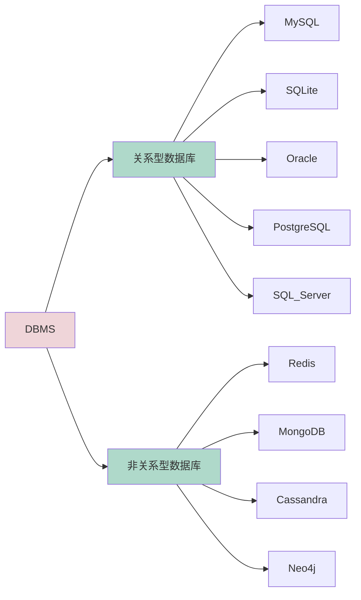
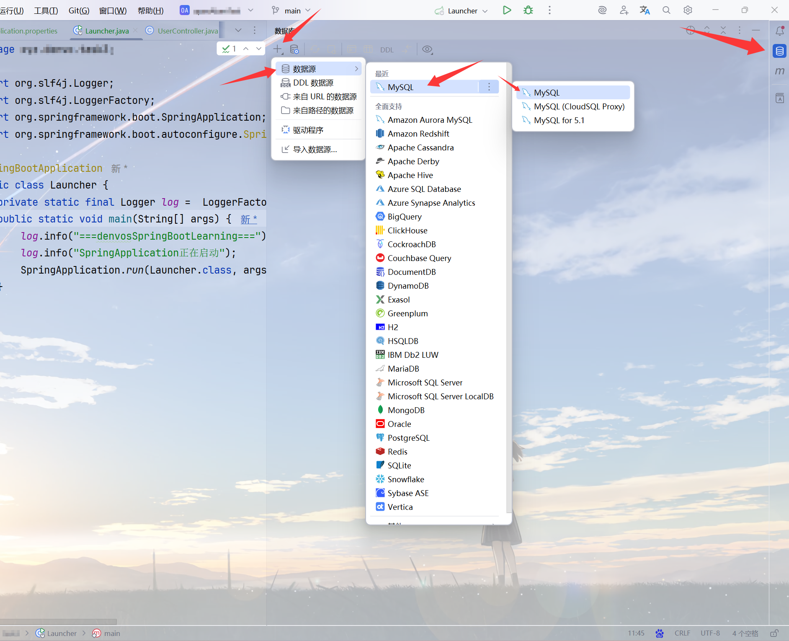
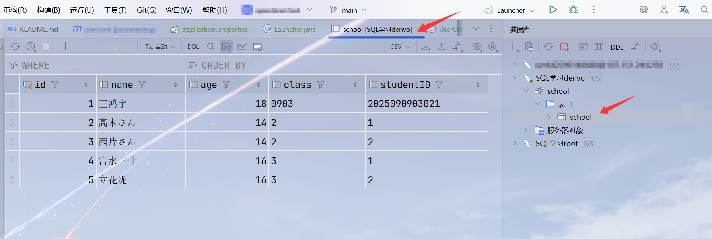
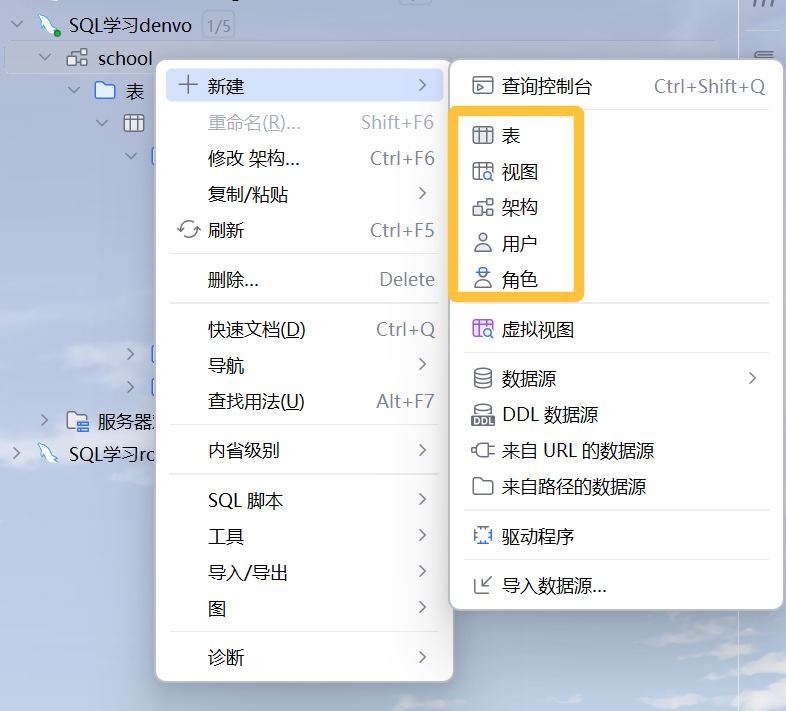

## Task1

Q：什么是数据库？什么是DBMS？

A：数据库就是存储和管理数据的一个集合，能够对数据进行增删改查之类的操作。DBMS是数据库管理软件的缩写，用来管理和维护数据库。

Q：你知道常⻅的DBMS有哪些吗？

A：有如下这些（并做好了分类）：


Q：什么是主键？什么是外键？他们的作⽤是什么？

A：主键是用于精准确定每一对数据的字段，主键的值不能重复，也不能为空。外键是在一张表中引用另一张表的主键的字段，它可以使两张表产生关联，也能保证不同表中数据的一致性，还能方便同时查询多个表。

## Task2

Q：安装MySQL

A：我使用的是Ubuntu，所以我使用包管理器安装：`sudo apt install mysql-server -y`。不过我的Ubuntu在VMWare上运行，为了后续连接到MySQL，我的虚拟机网络设置为桥接模式。

安装后通过`sudo systemctl status mysql`看一下MySQL是否启动（一般都会自动启动），如果没有启动的话，使用`sudo systemctl start mysql`启动MySQL。

接下来在Linux终端内配置MySQL。这里我选择使用内置的向导来完成操作。
```bash
~$ sudo mysql_secure_installation 

Securing the MySQL server deployment.

Connecting to MySQL using a blank password.

VALIDATE PASSWORD COMPONENT can be used to test passwords
and improve security. It checks the strength of password
and allows the users to set only those passwords which are
secure enough. Would you like to setup VALIDATE PASSWORD component?

Press y|Y for Yes, any other key for No: y

There are three levels of password validation policy:

LOW    Length >= 8
MEDIUM Length >= 8, numeric, mixed case, and special characters
STRONG Length >= 8, numeric, mixed case, special characters and dictionary                  file

Please enter 0 = LOW, 1 = MEDIUM and 2 = STRONG: 0

Skipping password set for root as authentication with auth_socket is used by default.
If you would like to use password authentication instead, this can be done with the "ALTER_USER" command.
See https://dev.mysql.com/doc/refman/8.0/en/alter-user.html#alter-user-password-management for more information.

By default, a MySQL installation has an anonymous user,
allowing anyone to log into MySQL without having to have
a user account created for them. This is intended only for
testing, and to make the installation go a bit smoother.
You should remove them before moving into a production
environment.

Remove anonymous users? (Press y|Y for Yes, any other key for No) : y
Success.


Normally, root should only be allowed to connect from
'localhost'. This ensures that someone cannot guess at
the root password from the network.

Disallow root login remotely? (Press y|Y for Yes, any other key for No) : n

 ... skipping.
By default, MySQL comes with a database named 'test' that
anyone can access. This is also intended only for testing,
and should be removed before moving into a production
environment.


Remove test database and access to it? (Press y|Y for Yes, any other key for No) : y
 - Dropping test database...
Success.

 - Removing privileges on test database...
Success.

Reloading the privilege tables will ensure that all changes
made so far will take effect immediately.

Reload privilege tables now? (Press y|Y for Yes, any other key for No) : y
Success.

All done!
```

现在我们就可以登录MySQL了。使用`sudo mysql -u root -p`登录：

```bash
denvo@denvo-virtual-machine:~$ sudo mysql -u root -p
Enter password: 
Welcome to the MySQL monitor.  Commands end with ; or \g.
Your MySQL connection id is 8
Server version: 8.0.43-0ubuntu0.24.04.1 (Ubuntu)

Copyright (c) 2000, 2025, Oracle and/or its affiliates.

Oracle is a registered trademark of Oracle Corporation and/or its
affiliates. Other names may be trademarks of their respective
owners.

Type 'help;' or '\h' for help. Type '\c' to clear the current input statement.

mysql>
```

接下来我将创建一个普通用户用来进行一般的SQL操作：

个人在用这种不用于实际的环境时喜欢设置一些简单密码（比如123456789），这样在输入密码时就能快速输入（比如123456789，直接用手指把键盘字母区上方的数字这么按住然后从1滑到9，就能快速输入了）。所以我先调整下设置，把合法的密码等级调整为low，然后再创建用户，并直接把所有权限给它（实际不是很建议这么做）。

```bash
mysql> SHOW VARIABLES LIKE 'validate_password%';
+-------------------------------------------------+--------+
| Variable_name                                   | Value  |
+-------------------------------------------------+--------+
| validate_password.changed_characters_percentage | 0      |
| validate_password.check_user_name               | ON     |
| validate_password.dictionary_file               |        |
| validate_password.length                        | 8      |
| validate_password.mixed_case_count              | 1      |
| validate_password.number_count                  | 1      |
| validate_password.policy                        | MEDIUM |
| validate_password.special_char_count            | 1      |
+-------------------------------------------------+--------+
8 rows in set (0.01 sec)

mysql> SET GLOBAL validate_password.policy=LOW;
Query OK, 0 rows affected (0.00 sec)

mysql> CREATE USER 'denvo'@'192.168.110.%' IDENTIFIED BY '123456789';
Query OK, 0 rows affected (0.01 sec)

mysql> GRANT ALL PRIVILEGES ON *.* TO 'denvo'@'192.168.110.%';
Query OK, 0 rows affected (0.04 sec)

mysql> FLUSH PRIVILEGES;
Query OK, 0 rows affected (0.00 sec)
```

为了方便以后可能的操作，我也把root的远程登录权限给放开：

```bash
mysql> CREATE USER 'root'@'192.168.110.%' IDENTIFIED WITH mysql_native_password BY '123456789';
Query OK, 0 rows affected (0.00 sec)

mysql> GRANT ALL PRIVILEGES ON *.* TO 'root'@'192.168.110.%' WITH GRANT OPTION;
Query OK, 0 rows affected (0.02 sec)

mysql> FLUSH PRIVILEGES;
Query OK, 0 rows affected (0.00 sec)
```

好了，现在我就可以直接远程登录MySQL来进行操作了。至于图形化操作MySQL，我直接使用IDEA内置的数据库功能连接（我的IDEA版本是2025.1.2 Ultimate Edition）。

打开IDEA，在菜单栏中找到“视图”，并在其中找到“工具窗口” -> “数据库”。


当然如果右边的边栏有“数据库”的按钮，也可以直接点击它来打开。接下来直接连接MySQL，根据图中的箭头找到“+” -> “数据源” -> “MySQL” -> “MySQL”并点击。


就会弹出如下窗口。填写里面的数据，主机填Ubuntu的IP地址，用户和密码就填刚才创建的用户名和密码，然后点击下面的“测试连接”，当测试成功时点击右下角的“应用”。


连接完成后即可在最开始的“数据库”视图中看到刚才连接到的MySQL数据库。


可以右键刚才连接的数据库，点击“新建” -> “查询控制台”，会出现一个新的标签页，在里面可以运行SQL语句，比如这样：


如果想便捷地查看数据库中的内容，可以点击“未选择架构”旁边的“...”，勾选你想查看的数据库，就能在列表中显示你想看到的数据库了。展开目标数据库，展开“表”一项，找到你希望查看的表，双击一下，就能在新的标签页中看到表的内容了，就像这样：



如果想对目标进行增删改查操作，大部分都能在“数据库”视图中右键目标，在弹出式菜单里面进行操作。



## Task3

Q：创建⼀个database，编写SQL语句来实现以下需求：
| id | name | age | gender |
| --- | --- | --- | --- |
| 1 | 张三 | 19 | 1 |
| 2 | 李四 | 18 | 2 |
| 3 | 王五 | 22 | 2 |
| 4 | 赵六 | 21 | 1 |

- id为⾃增字段
- gender表示性别：1表示男，2表示⼥
1. 创建表：编写sql语句，创建上述student表
2. 插⼊数据：编写sql语句，向student表中插⼊这四条数据
3. 查询数据：
    - 查询所有学⽣的姓名和性别
    - 查询年龄⼤于20的学⽣的姓名和年龄
    - 查询姓‘张’的学⽣的所有信息（要求使⽤`like`操作符）

A：创建表：
```sql
CREATE TABLE students(
    id INT AUTO_INCREMENT PRIMARY KEY,
    name VARCHAR(10),
    age INT,
    gender INT
);
```
插入数据：
```sql
INSERT INTO students(id, name, age, gender) VALUES 
    ( 1, '张三', 19, 1),
    (2, '李四', 18, 2),
    (3, '王五', 22, 2),
    (4, '赵六', 21, 1);
```
查询数据：
- 查询所有学生的姓名和性别
    ```sql
    SELECT name, gender FROM students;
    ```
    输出：
    | name | gender |
    | --- | --- |
    | 张三 | 1 |
    | 李四 | 2 |
    | 王五 | 2 |
    | 赵六 | 1 |
- 查询年龄⼤于20的学⽣的姓名和年龄
    ```sql
    SELECT name, age FROM students WHERE age > 20;
    ```
    输出:
    | name | age |
    | --- | --- |
    | 王五 | 22 |
    | 赵六 | 21 |
- 查询姓‘张’的学⽣的所有信息（要求使⽤`like`操作符）
    ```sql
    SELECT * FROM students WHERE name LIKE '张%';
    ```
    输出：
    | id | name | age | gender |
    | --- | --- | --- | --- |
    | 1 | 张三 | 19 | 1 |

## Task4

Q：请了解⼀下逻辑外键，联表查询，聚合函数的相关知识。

A：逻辑外键应该就是外键？既然这样我直接引用我在Task1中回答的答案：
> 外键是在一张表中引用另一张表的主键的字段，它可以使两张表产生关联，也能保证不同表中数据的一致性，还能方便同时查询多个表。

联表查询就是使用`JOIN`来一次性查出多个有关联的表中的数据时进行的操作，有INNER JOIN、LEFT JOIN、RIGHT JOIN、FULL JOIN等类型。聚合函数就是常见的用于计算和统计的函数，比如求和、求平均值、最大值、最小值等的函数。

Q：这⾥有⼀张成绩表，与学⽣表以**逻辑外键**的⽅式关联。

| id | student_id | subject | Score |
| --- | --- | --- | --- |
| 1  | 1 | 语文 | 98 |
| 2  | 1 | 数学 | 89 |
| 3  | 1 | 英语 | 88 |
| 4  | 2 | 语文 | 99 |
| 5  | 2 | 数学 | 90 |
| 6  | 2 | 英语 | 97 |
| 7  | 3 | 语文 | 65 |
| 8  | 3 | 数学 | 74 |
| 9  | 3 | 英语 | 89 |
| 10 | 4 | 语文 | 68 |
| 11 | 4 | 数学 | 96 |
| 12 | 4 | 英语 | 60 |

建⽴这张grade表，完成以下⼩练习：
- 查询数学这⻔学科分数在80分以上的学⽣，查询结果应包括：学⽣id，学⽣姓名，数学成绩
- 查询每个学⽣三⻔课的总成绩，查询结果应包括：学⽣id，学⽣姓名，总成绩
- 查询数学成绩⾼于数学平均分的学⽣，查询结果包括：学⽣id，学⽣姓名，数学成绩

A：建立grade表：
```sql
CREATE TABLE grade(
    id INT AUTO_INCREMENT PRIMARY KEY,
    student_id INT,
    subject VARCHAR(2),
    Score INT,
    FOREIGN KEY (student_id) REFERENCES students(id)
);
```
插入数据：
```sql
INSERT INTO grade VALUES
    (1, 1, '语文', 98),
    (2, 1, '数学', 89),
    (3, 1, '英语', 88),
    (4, 2, '语文', 99),
    (5, 2, '数学', 90),
    (6, 2, '英语', 97),
    (7, 3, '语文', 65),
    (8, 3, '数学', 74),
    (9, 3, '英语', 89),
    (10, 4, '语文', 68),
    (11, 4, '数学', 96),
    (12, 4, '英语', 60);
```
查询数据：
- 数学在80分以上的学⽣
    ```sql
    SELECT student_id, name, Score FROM grade INNER JOIN students ON grade.student_id = students.id WHERE subject = '数学' AND Score > 80;
    ```
    输出：
    | student_id | name | Score |
    | --- | --- | --- |
    | 1 | 张三 | 89 |
    | 2 | 李四 | 90 |
    | 4 | 赵六 | 96 |
- 每个学⽣三⻔课的总成绩
    ```sql
    SELECT student_id, name, SUM(grade.Score) AS totalScore FROM students INNER JOIN grade ON students.id = grade.student_id GROUP BY student_id, name;
    ```
    输出：
    | id | name | totalSocre |
    | --- | --- | --- |
    | 1 | 张三 | 275 |
    | 2 | 李四 | 286 |
    | 3 | 王五 | 228 |
    | 4 | 赵六 | 224 |
- 数学成绩⾼于数学平均分的学⽣
    ```sql
    SELECT student_id, name, Score FROM grade INNER JOIN students ON grade.student_id = students.id WHERE subject = '数学' AND Score > (SELECT AVG(Score) FROM grade WHERE subject = '数学');
    ```
    输出：
    | student_id | name | Score |
    | --- | --- | --- |
    | 1 | 张三 | 89 |
    | 2 | 李四 | 90 |
    | 4 | 赵六 | 96 |