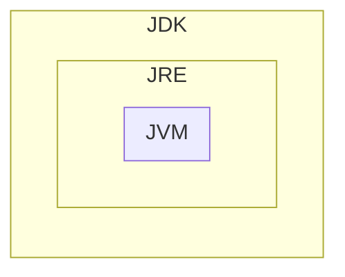
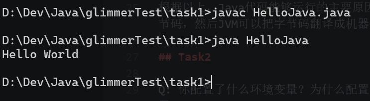
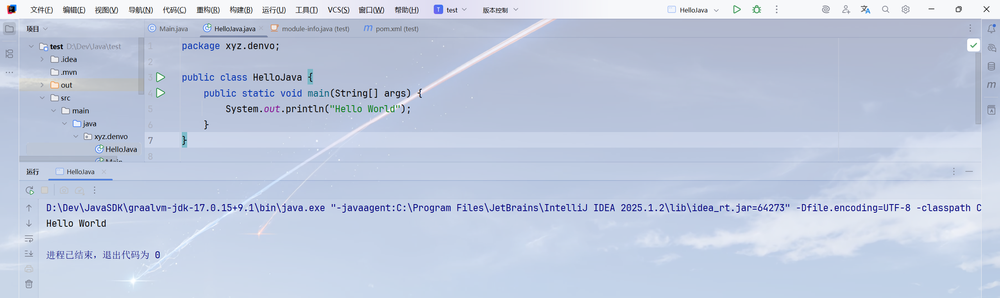

## Task1

Q: 什么是JDK，什么又是JRE，JVM？他们之间是什么关系？为什么有了它们就能运行JAVA代码？

A: 我回答得可能比较主观哈，请见谅。

作为一个Minecraft玩家的理解，JRE（Java Runtime Environment）就像它的名字一样，就是一个运行Java程序的环境，有了JRE才能运行Java程序，就像运行Python程序也需要Python运行环境一样。

JDK（Java Development Kit）相比于JRE，多提供了编译器等工具，只有使用JDK才能编写Java程序，而JRE只能运行已经写好并编译好的Java程序。

JVM（Java Virtual Machine）就是Java程序实际的运行环境。Java程序（一般是字节码）需要JVM翻译成本地机器码才能执行。同时，Java号称的“一次编写，到处运行”也是通过JVM来屏蔽系统底层差异，使Java程序运行在差异较小的环境中执行。

所以，JDK、JRE、JVM的关系如下：



根据以上，Java代码能够运行的主要原因是JDK提供的编译器能把Java代码编译成字节码，然后JVM可以把字节码翻译成机器码，从而使Java程序成功运行。

## Task3

Q: 你配置了什么环境变量？为什么配置了环境变量后，就能在命令行使用相关命令了？

A: 我配置的环境变量如下：
```js
JAVA_HOME = /opt/graalvm17
PATH = $PATH:$JAVA_HOME/bin
```

其中PATH环境变量能告诉操作系统可以去哪里找可执行程序，且命令行中的相关命令大多都对应一个实际的可执行程序，所以当我把JDK的可执行程序所在目录添加到PATH之后命令行就能使用相关命令了。

## Task3

Q: 在编译和运行过程中涉及的文件和这些文件的作用？

A: 这个运行过程直接涉及到的文件：

- HelloJava.java（源文件）
- javac.exe（编译器）
- HelloJava.class（源文件编译后的字节码文件）
- java.exe（JVM启动器和命令行工具）
- jvm.dll/libjvm.so（JVM）

其中源文件保存着代码，编译器把Java代码编译为字节码文件，JVM启动器获取目标字节码文件和其他信息并创建JVM实例，最后JVM把字节码文件翻译成机器码并执行。

以下为代码执行结果的截图。



## Task4

参见下图



## 注

我的系统其实是Windows 11，但是为了写的方便，在“环境变量”处使用了Linux的表示方法。此作业是我自己写的，不是AI！