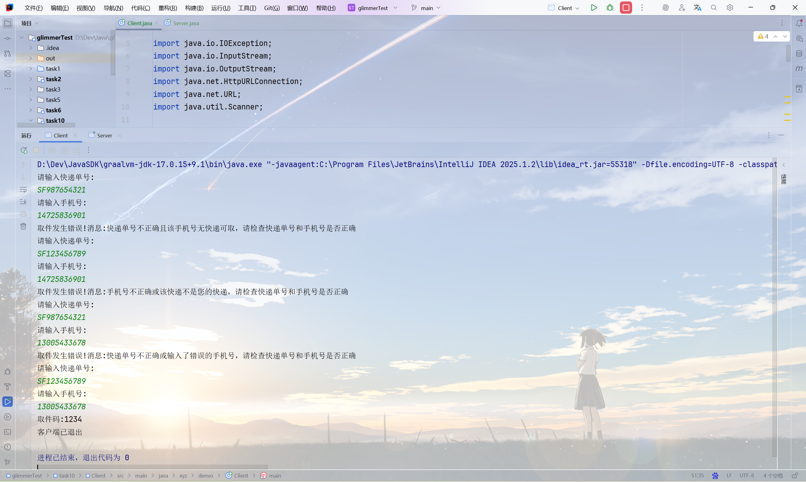
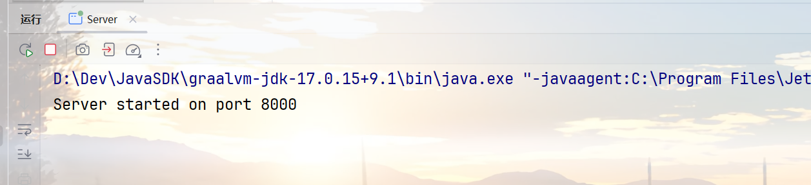

## Task1

Q: 什么是maven?

A: Maven是一个自动化的构建工具，用于项目的管理和构建，可以管理项目的依赖，方便开发、打包、测试和部署，是一个经常使用的工具。

Q: 什么是jar包？

A: jar包是一堆class字节码以及资源文件等的集合，方便项目的部署、运行和分发。

Q: maven和jar包有关系吗？有什么关系？

A: 有关系，但这俩是相互独立的。jar包可以通过jdk中的`jar`命令打包，并不一定依赖maven。只是maven作为一个构建工具，maven支持把项目整体打包成一个jar包来运行。

Q: 我们为什么要用maven？

A: 因为方便，当项目较大的时候，很多库的依赖以及项目的打包是一件非常麻烦的事情，通过maven可以极大地简化我们的操作。

Q: 你的java环境配置好了吗？

A: 那肯定配置好了啊，都最后一个（不算附加题）Task了。maven也配置好了的，都已经用在task10中的Task2了。

Q: 看看你的maven是什么版本。

A:

```bash
~$ mvn -version
Apache Maven 3.9.10 (5f519b97e944483d878815739f519b2eade0a91d)
Maven home: D:\Dev\Java_Maven
Java version: 21.0.7, vendor: Oracle Corporation, runtime: D:\Dev\JavaSDK\graalvm-jdk-21.0.7+8.1
Default locale: zh_CN, platform encoding: UTF-8
OS name: "windows 11", version: "10.0", arch: "amd64", family: "windows"

~$
```

Q: 怎么配置你自己的本地仓库位置？

A: 找到maven的配置文件`settings.xml`，并修改配置`<localRepository>D:\Dev\Java_Lib\Maven</localRepository>`为指定目录即可。

Q: 中央仓库是什么?

A: 就是Maven总仓库，需要库和插件的时候如果哪里都找不到，就会去中央仓库寻找。

Q: 私服又是什么？

A: 第三方搭建的Maven仓库。常见的有第三方的maven镜像服务器，以及公司私有化部署的maven仓库。

Q: 你的IDEA关联maven了吗？

A: 关联了的。

Q: 一个maven项目都需要配置什么参数？

A: GroupId, ArtifactId, Version参数标识一个项目和依赖。

还有一些可选的参数，比如依赖配置（dependencies），构建配置（build），仓库配置（repositories），父POM。

Q: 你的项目结构是什么样的？你知道你的代码、配置文件、测试代码、测试配置文件、maven项目配置文件都在哪里吗？

A: 以Task10的task2的服务端为例:

```bash
D:.
│  pom.xml   //maven项目配置文件
│
├─.mvn
├─src
│  ├─main
│  │  ├─java   //源文件，代码放在这里
│  │  │  └─xyz
│  │  │      └─denvo
│  │  │              Server.java
│  │  │
│  │  └─resources   //资源文件和配置文件等
│  └─test
│      ├─java   //测试代码
│      └─resources   //测试代码的资源、配置文件
└─target   //代码运行编译输出
    ├─classes
    │  └─xyz
    │      └─denvo
    │              Server$QueryHandler.class
    │              Server$RequestJson.class
    │              Server$ResponseJson.class
    │              Server.class
    │
    └─generated-sources
        └─annotations
```

Q: pom.xml文件是什么？它有什么用？它的基本配置有哪些？你能通过这个文件管理你的jar包版本、项目类型吗？

A: 作为一个maven项目的maven配置文件，里面记录了这个maven项目的基本信息，使用的依赖以及编译配置等内容。maven根据这个文件来自动化构建和打包等。所以，可以通过这个文件管理jar版本和项目类型。

Q: 怎么导入你需要的jar包？

A: 一般使用`<dependency></dependency>`标签导入。

Q: maven的常用命令有哪些?

A: 

- mvn clean   //清理编译输出
- mvn compile   //编译
- mvn test   //测试
- mvn package   //打包
- mvn install   //把项目提交到本地仓库
- mvn deploy   //把项目提交到远程仓库（不是git那一套）

Q: 观察IDEA中的maven面板，看看可以快速执行哪些maven指令。

A: 以上常用命令全部包含。除这些之外，还有：

- validate   //验证项目是否正确
- verify   //检查代码质量
- site   //生成项目信息网站

## Task2

客户端源代码参见task10/Client/src，服务端源代码参见task10/Server/src。以下为运行结果:


