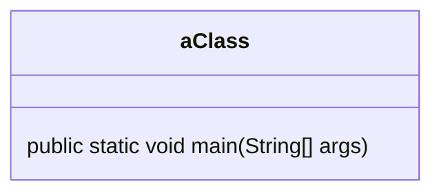
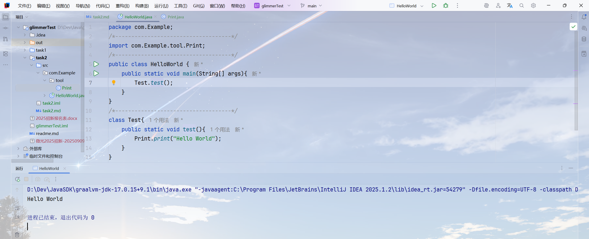

## Task1

Q: 这份代码被分成了四个部分，请尝试解释每个部分，回答什么是包（pakage），包的作用是什么，什么是main函数，并总结出一个单文件java程序的基本结构。

```java
package com.Example;
/*------------------------------------*/
import com.Example.tool.Print;
/*------------------------------------*/
public class HelloWorld {
        public static void main(String[] args){
            Test.test();
        }
}
/*------------------------------------*/
class Test{
    public static void test(){
        Print.print("Hello World");
    }
}
```

A: 包可以理解为一堆类、接口等东西的集合，方便程序员管理和使用。包用来方便多个类和接口等的调用和实现，同时也可以用来区分两个名称一样的类和接口等。

main函数是一个公共的、静态的、无返回值的函数，JVM执行Java代码时，就是这个main函数作为Java程序的入口点。

一个单文件Java程序的基本结构包括：

- 一个类
- 这个类中的一个main函数

它们的关系如下：



一个单文件Java程序至少包括这些才能够成功运行。

Q: 请你更改main函数，使用命令行或者IDEA运行这个程序传入“111 222 333”这三个参数，并在main函数中打印出来。

A: 更改后的main函数如下：

```java
public static void main(String[] args) {
        for (int i = 0; i < args.length; i++) {
            System.out.print(args[i]);
            if (i < args.length - 1) {
                System.out.print(" ");
            }
        }
    }
```

执行结果如下：

```bash
~$ java HelloWorld 111 222 333
111 222 333
~$
```

## Task3

项目具体源代码见task2文件夹，项目执行截图如下：

