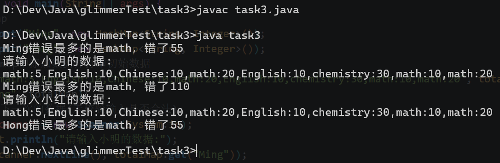

## Task1

Q: 基本类型有八种，都是Java语言预先定义好的关键字，分别是整型（4种），字符型（1种），浮点型（2种），布尔型（1种）。说出这八种基本数据类型。

A: 这八种分别是：

- 整型:
    - byte
    - short
    - int
    - long
- 字符型: char
- 浮点型:
    - float
    - double
- 布尔型: boolean

Q: 说出四种整型数据类型占用的字节数和表示范围。

A:

| 整型数据类型 | 占用字节数 | 表示范围(两头均包含)                                                        |
|--------|-------|--------------------------------------------------------------------|
| byte   | 1     | -128~127                                                           |
| short  | 2     | -32768~32767                                                       |
| int    | 4     | -2^31 (-2147483648) ~ 2^31 -1 (2147483647)(10位数)                   |
| long   | 8     | -2^63 (-9223372036854775808) ~ 2^63 -1 (9223372036854775807)(19位数) |

Q: 了解隐式类型转换和显式类型转换，回答这个过程涉及到的是隐式类型转换还是显式类型转换，b的值是多少，为什么会是这个值。

```java
int a=4;
char c='0';
int b=a+c;
```

A: 显式类型转换就是用代码明确要求此类型转换成另一个类型，比如`a = (double) 4`就是强制把`4`转换为double类型。

隐式类型转换就是代码没有明确要求转换，但是编译器和JVM会自动处理的情况。比如`byte a = 1;int b = a;`就在运行第二个语句时自动把a的byte类型转换成b的int类型。

题目中的代码应该是隐式类型转换，b=52。因为char类型和C语言差不多，在处理像题目这样的类型转换的时候char转int会得到char变量中相应字符对应的ANSII编码的值，而`0`对应的是48，所以加起来是52。

Q: 请了解包装类，引用类型和基本数据类型缓存池。给出下面代码的输出结果并解释原因。

```java
Integer x = new Integer(18);
Integer y = new Integer(18);
System.out.println(x == y);

Integer z = Integer.valueOf(18);
Integer k = Integer.valueOf(18);
System.out.println(z == k);

Integer m = Integer.valueOf(300);
Integer p = Integer.valueOf(300);
System.out.println(m == p);
```

A: 输出结果如下:

```bash
false
true
false
```

上面一共通过3种形式创建了Integer包装类。首先第一种是直接用new关键字创建的，而代码中的x、y、z、k、m、p都是一个对象。在java中直接对两个对象使用==来比较，实际上是比较的两个对象引用的内存地址是否相同。第一种方法的两次new创建对象，实际上是就是新建了两个对象，只是这两个对象包含的int值相等。但是这两个对象并不一样，比如他们在堆中的内存地址就不一样，他们只是内容一样的两个不同的对象。


再看第二种和第三种。他们都是使用了里面的静态方法来构造对象。但是Integer有个缓存池(实际是静态内部类IntegerCache)，会缓存[-128, 127]范围内的整数对象。第二种z和k的值是18，在范围内，所以直接返回缓存的对象，既然如此，z和k的引用肯定就是一样的了，都是同一个缓存嘛。

第三种就是因为值300超过了缓存，所以实际上还是新建了对象的。此时跟第一种就差别不大了，所以返回false。

## Task3

Q: 请执行下列代码，给出结果，并大概解释计算的过程。

```java
int a = 5;
int b = 7;
int c= (++a) + (b++);
System.out.println(c);
System.out.println(a+" "+b);
```

A: 结果:

```bash
13
6 8
```

第三行代码的执行过程如下:

1. ++a是前自增运算符，会先让a的值+1再运行c的赋值。所以此时a=6
2. b++是后自增运算符，会先运行c的赋值再让b的值+1.所以此时计算c=6+7=13
3. 现在b自增，所以现在b=8

Q: int、float在计算机是怎么储存的？为什么会发生两个正数相加结果为负数的事情？

A: int实际上就是把整数转换为二进制数，并在空位补0，并填满4个字节来储存的(最开头的一个位置是符号位，0则是正数)；float稍微复杂一点，由符号位、指数位和尾数位组成，其中指数位通过存储指数值来存储整数部分，尾数位存储小数部分。

两个正数相加结果为负数，一般都是因为发生范围溢出了。运算结果过大导致符号位也改变了，所以就从正数变成负数了。

## Task3

Q: 建模并处理数据`math:5,English:10,Chinese:10,math:20,English:10,chemistry:30,math:10,math:20`

A: 使用HashMap<String, Integer>来存储数据，并通过字符串分割(String.split()方法)和字符串转化(Integer.parseInt()方法)来获取数据。具体代码如下:

```java
import java.util.HashMap;

String src = "math:5,English:10,Chinese:10,math:20,English:10,chemistry:30,math:10,math:20";
HashMap<String, Integer> map = new HashMap<>();
String splits = src.split(",");
for(String split : splits){
    String details = split.split(":");
    if (map.containsKey(details[0])) {
        map.put(details[0], map.get(details[0]) + Integer.parseInt(details[1]));    
    } else {
        map.put(details[0], Integer.parseInt(details[1]));    
    }
}
```

Q: 排序找到错的最多的科目。

A: 使用Map接口提供的forEach方法遍历每一个数据并比较出结果。

```java
import java.util.HashMap;

HashMap<String, Integer> map;   //在上面定义了的
final String[] subject = new String[1];
final int[] times = {0};
totalMap.get(name).forEach((k, v) -> {
    if (v > times[0]) {
        subject[0] = k;
        times[0] = v;
    }
});
System.out.printf("错误最多的是%s，错了%d\n", subject[0], times[0]);
```

Q: 还想要后续考试的错题也能加入，你需要为他设计一个能够让小明输入数据的程序。

A: 使用Scanner。假定后续小明输入的数据和之前的结构相同。

```java
Scanner scanner = new Scanner(System.in);
System.out.println("请输入小明的数据:");
String src = scanner.nextLine();
scanner.close();
//后续就跟Task3的第一问获取数据的办法是一样的了
```

Q: 小明想统计自己的，同时也想统计小红的错题，请你设计一个程序能够兼容二者。

A: 可以再次使用HashMap来包装。

```java
import java.util.HashMap;

HashMap<String, HashMap<String, Integer>> totalMap = new HashMap<>();
HashMap<String, Integer> map1, map2;   //这里的map就和前面的是一样的了
totalMap.put("Ming", map1);
totalMap.put("Hong", map2);
//其他的处理逻辑和上面差不多
```

将以上四个问题全部一次性解决，我们可以得到`task3.java`程序（位于task3文件夹内，与此文档同目录）。以下是此程序的运行结果:

