## Task4

Q: 现在有A,B,C三个柱子，在A柱上有n块铁饼，现在要把A柱上的n块铁饼都移动到C柱上，请补全函数，使得函数打印出移动的过程。要求给出你代码的具体思路，可以写在文档或者代码注释中。

A: 汉诺塔问题是一个比较经典的问题。但我还是要先通过数学归纳法找找规律先。比如以下是一个5层的汉诺塔。

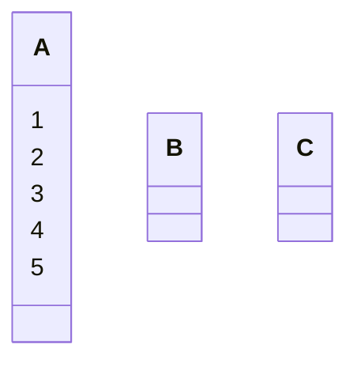

第一步，把最上层的移动到C柱上，即完成第一层的汉诺塔。（共1步）

A ==> C
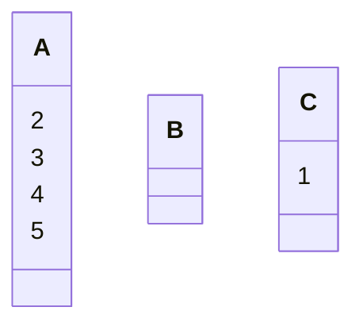

但如果是完成两层的汉诺塔，就需要这样移动。（共3步）

A ==> B
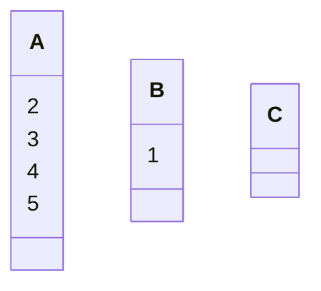
A ==> C
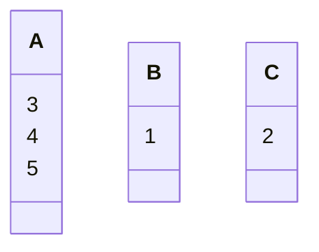
B ==> C


如果是三层，就需要在第一层的汉诺塔的基础上继续操作。（共7步）

A ==> B

C ==> B
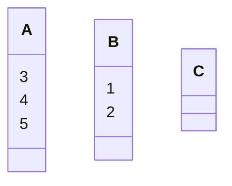
A ==> C
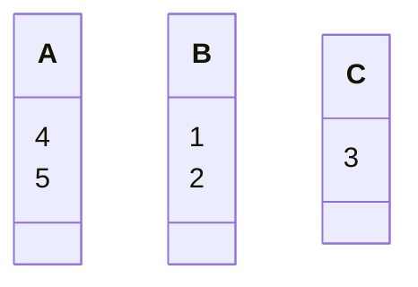
B ==> A
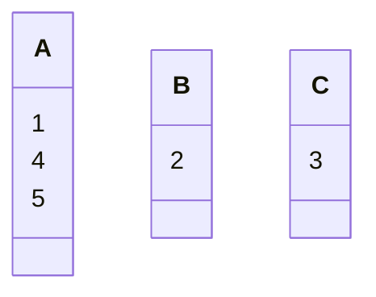
B ==> C
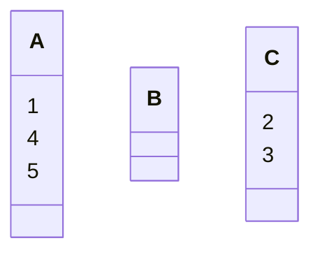
A ==> C
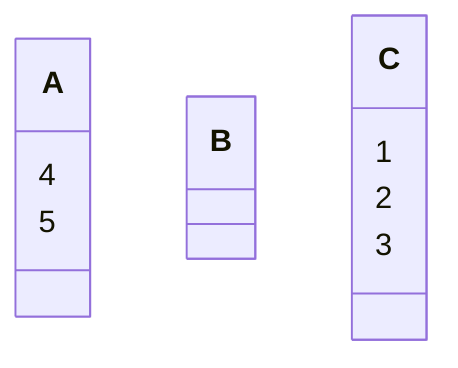

对于4层的汉诺塔，根据测试，应在2层汉诺塔的基础上操作：（共15步）

A ==> B

C ==> A

C ==> B

A ==> B
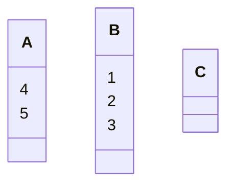
A ==> C
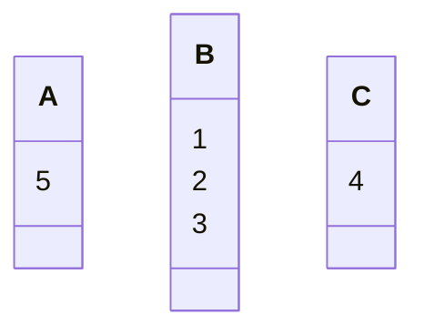
B ==> C
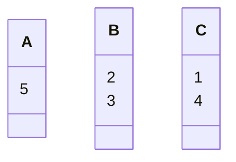
B ==> A
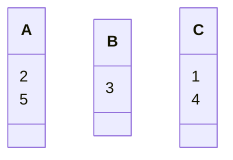
C ==> A

B ==> C
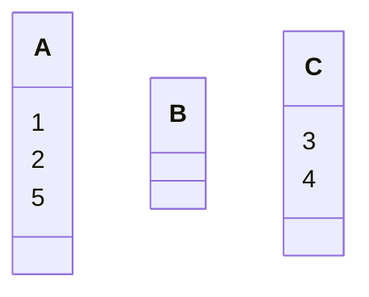
A ==> B
```mermaid
classDiagram
    class A {
        2
        5
    }
    class B {
        1
    }
    class C {
        3
        4
    }
```
A ==> C
```mermaid
classDiagram
    class A {
        5
    }
    class B {
        1
    }
    class C {
        2
        3
        4
    }
```
B ==> C
```mermaid
classDiagram
    class A {
        5
    }
    class B
    class C {
        1
        2
        3
        4
    }
```

对于5层的汉诺塔，则在3层汉诺塔的基础上再操作。（共31步）
A ==> B
```mermaid
classDiagram
    class A {
        5
    }
    class B {
        4
    }
    class C {
        1
        2
        3
    }
```
C ==> B
```mermaid
classDiagram
    class A {
        5
    }
    class B {
        1
        4
    }
    class C {
        2
        3
    }
```
C ==> A
```mermaid
classDiagram
    class A {
        2
        5
    }
    class B {
        1
        4
    }
    class C {
        3
    }
```
B ==> A
```mermaid
classDiagram
    class A {
        1
        2
        5
    }
    class B {
        4
    }
    class C {
        3
    }
```
C ==> B
```mermaid
classDiagram
    class A {
        1
        2
        5
    }
    class B {
        3
        4
    }
    class C
```
A ==> C
```mermaid
classDiagram
    class A {
        2
        5
    }
    class B {
        3
        4
    }
    class C {
        1
    }
```
A ==> B
```mermaid
classDiagram
    class A {
        5
    }
    class B {
        2
        3
        4
    }
    class C {
        1
    }
```
C ==> B
```mermaid
classDiagram
    class A {
        5
    }
    class B {
        1
        2
        3
        4
    }
    class C
```
A ==> C
```mermaid
classDiagram
    class A
    class B {
        1
        2
        3
        4
    }
    class C {
        5
    }
```
B ==> A
```mermaid
classDiagram
    class A {
        1
    }
    class B {
        2
        3
        4
    }
    class C {
        5
    }
```
B ==> C
```mermaid
classDiagram
    class A {
        1
    }
    class B {
        3
        4
    }
    class C {
        2
        5
    }
```
A ==> C
```mermaid
classDiagram
    class A
    class B {
        3
        4
    }
    class C {
        1
        2
        5
    }
```
B ==> A
```mermaid
classDiagram
    class A {
        3
    }
    class B {
        4
    }
    class C {
        1
        2
        5
    }
```
C ==> B
```mermaid
classDiagram
    class A {
        3
    }
    class B {
        1
        4
    }
    class C {
        2
        5
    }
```
C ==> A
```mermaid
classDiagram
    class A {
        2
        3
    }
    class B {
        1
        4
    }
    class C {
        5
    }
```
B ==> A
```mermaid
classDiagram
    class A {
        1
        2
        3
    }
    class B {
        4
    }
    class C {
        5
    }
```
B ==> C
```mermaid
classDiagram
    class A {
        1
        2
        3
    }
    class B
    class C {
        4
        5
    }
```
A ==> C
```mermaid
classDiagram
    class A {
        2
        3
    }
    class B
    class C {
        1
        4
        5
    }
```
A ==> B
```mermaid
classDiagram
    class A {
        3
    }
    class B {
        2
    }
    class C {
        1
        4
        5
    }
```
C ==> B
```mermaid
classDiagram
    class A {
        3
    }
    class B {
        1
        2
    }
    class C {
        4
        5
    }
```
A ==> C
```mermaid
classDiagram
    class A
    class B {
        1
        2
    }
    class C {
        3
        4
        5
    }
```
B ==> A
```mermaid
classDiagram
    class A {
        1
    }
    class B {
        2
    }
    class C {
        3
        4
        5
    }
```
B ==> C
```mermaid
classDiagram
    class A {
        1
    }
    class B
    class C {
        2
        3
        4
        5
    }
```
A ==> C
```mermaid
classDiagram
    class A
    class B
    class C {
        1
        2
        3
        4
        5
    }
```

根据以上几层汉诺塔的规律可以发现，n层的汉诺塔都是在第n-2层汉诺塔的基础上执行操作的。这样递推到第1、2层，发现奇数层的第一步是把第一个盘移动到C，偶数层的第一步是把第一个盘移动到B。