## Task1

Q: 请了解`if-else`相关知识。补全下面的函数：

```java
//这个函数用于判断传入的年份是否为闰年
//是闰年返回1，不是闰年返回2
boolean isLeapYear(int year){

}
```

A: 代码如下:

```java
boolean isLeapYear(int year){
    if (year % 400 == 0) {
        return true;
    } else if (year % 100 == 0) {
        return false;
    } else {
        return year % 4 == 0;
    }
}
```

Q: 你知道`switch-case`吗，有人说`switch-case`是`if-else`的语法糖(`syntax suger`)这是正确的吗?你知道他们的底层实现原理吗？

A: 我认为switch不是if的语法糖。if和switch在很多语言都有，比如C语言。不同编译器对if和switch的处理策略不同。比如部分编译器会在switch条目过少时会把switch变成if来编译，也能会把if优化成switch来编译。

再来看编译之后的汇编，if一般会直接编译成顺序比较的模式，这种简单的模式容易被CPU的分支预测命中，从而得到更加高的执行效率，缺点是当情况很多的时候会因为逐一比较而导致大量运算成本。而switch一般会被编译成跳转表这种间接跳转模式。情况很多的时候，switch的执行效率更高，但是由于是间接跳转，CPU对其的分支预测程度没有if高。

总的来看，它们的底层完全不一样（除了编译器手动把if优化成switch或把switch优化成if），所以二者根本就不是语法糖的关系，它们是两种独立的控制语句。

## Task2

Q: 补全下面函数：

```java
//这个函数打印一个高度为n的空心菱形，保证n为奇数
//如n=5,则打印如下图形：
//  *
// * *
//*   *
// * *
//  *
void print(int n){

}
```

A: 代码和测试见task4/Task2.java。主要使用printf和格式控制串来打印。

## Task3

Q: 请了解递归和迭代相关知识，为斐波那契数列实现两个版本。

```java
int Fibonacci(int n){
    
}
```

迭代和递归不同处在于哪里，为什么一般偏好迭代？循环是否能完全用递归来取代？

A: 代码和测试见task4/Task3.java。

迭代一般使用循环重复执行一段代码，并且使用变量及其计算获得结果，递归是在函数体内自己调用自己，并在函数体内定义终止条件。程序执行的时候每次调用函数都会把当前函数压入栈中，调用函数也有额外的开销，为了使程序更高效地运行（并防止堆栈溢出），我们偏好迭代。

毕竟功能相同的代码，肯定偏好性能更优的。

至于循环能否用递归替代，我只能说理论上可行。毕竟递归也是一种变相的“while循环”。但是一般都能写出循环了，就没有必要换成递归了。

## Task4

Q: 现在有A,B,C三个柱子，在A柱上有n块铁饼，现在要把A柱上的n块铁饼都移动到C柱上，请补全函数，使得函数打印出移动的过程。要求给出你代码的具体思路，可以写在文档或者代码注释中。

```java
//当n=3时，函数应该打印如下内容：
//A->C   (A->C的意思是把A柱最上方的铁饼移动到C柱上，以下同理)
//A->B
//C->B
//A->C
//B->A
//B->C
//A->C
void hanoi(int n){
	
}
```

A: 代码见task4/Task4.java。具体思路如下：

对于这种问题，一般先通过数学归纳法来找找规律。比如以下是一个5层的汉诺塔。

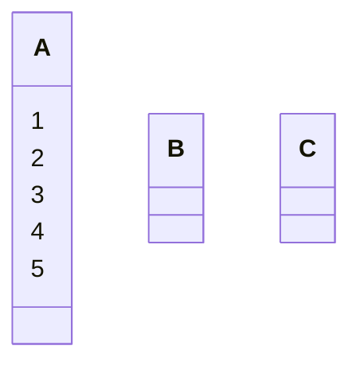

第一步，把最上层的移动到C柱上，即完成第一层的汉诺塔。（共1步）

A ==> C
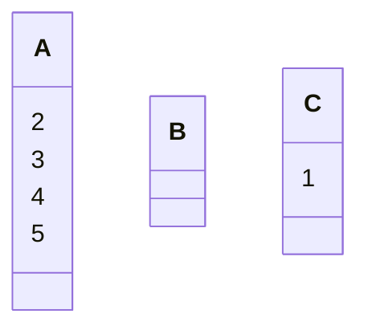

但如果是完成两层的汉诺塔，就需要这样移动。（共3步）

A ==> B
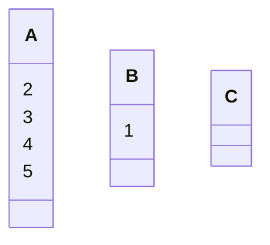
A ==> C
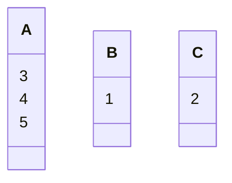
B ==> C


如果是三层，就需要在第一层的汉诺塔的基础上继续操作。（共7步）

A ==> B

C ==> B
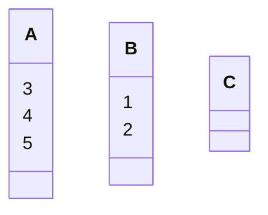
A ==> C
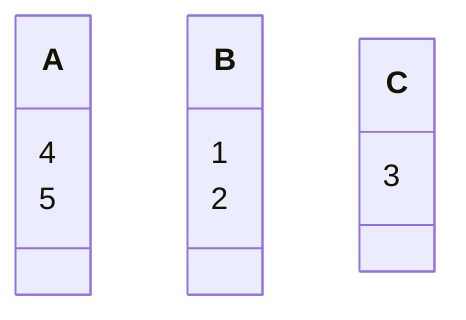
B ==> A
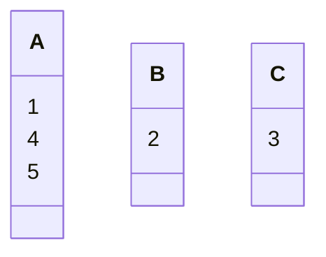
B ==> C
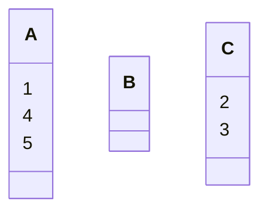
A ==> C
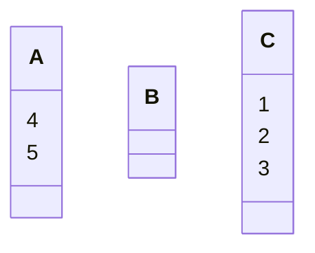

对于4层的汉诺塔，根据测试，应在2层汉诺塔的基础上操作：（共15步）

A ==> B

C ==> A

C ==> B

A ==> B
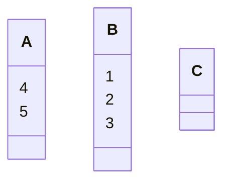
A ==> C
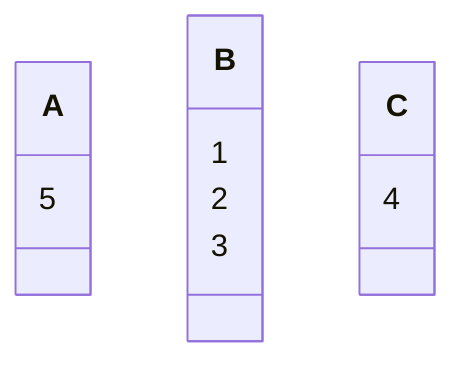
B ==> C
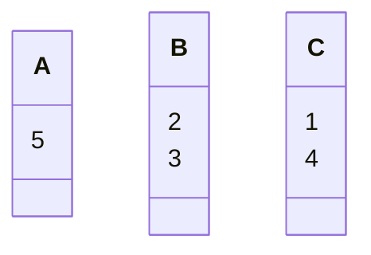
B ==> A
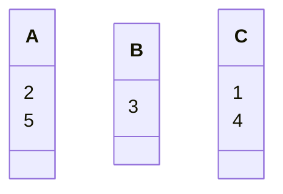
C ==> A

B ==> C
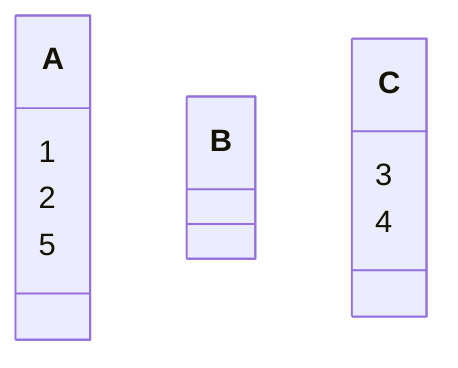
A ==> B
```mermaid
classDiagram
    class A {
        2
        5
    }
    class B {
        1
    }
    class C {
        3
        4
    }
```
A ==> C
```mermaid
classDiagram
    class A {
        5
    }
    class B {
        1
    }
    class C {
        2
        3
        4
    }
```
B ==> C
```mermaid
classDiagram
    class A {
        5
    }
    class B
    class C {
        1
        2
        3
        4
    }
```

对于5层的汉诺塔，则在3层汉诺塔的基础上再操作。（共31步）

A ==> B
```mermaid
classDiagram
    class A {
        5
    }
    class B {
        4
    }
    class C {
        1
        2
        3
    }
```
C ==> B
```mermaid
classDiagram
    class A {
        5
    }
    class B {
        1
        4
    }
    class C {
        2
        3
    }
```
C ==> A
```mermaid
classDiagram
    class A {
        2
        5
    }
    class B {
        1
        4
    }
    class C {
        3
    }
```
B ==> A
```mermaid
classDiagram
    class A {
        1
        2
        5
    }
    class B {
        4
    }
    class C {
        3
    }
```
C ==> B
```mermaid
classDiagram
    class A {
        1
        2
        5
    }
    class B {
        3
        4
    }
    class C
```
A ==> C
```mermaid
classDiagram
    class A {
        2
        5
    }
    class B {
        3
        4
    }
    class C {
        1
    }
```
A ==> B
```mermaid
classDiagram
    class A {
        5
    }
    class B {
        2
        3
        4
    }
    class C {
        1
    }
```
C ==> B
```mermaid
classDiagram
    class A {
        5
    }
    class B {
        1
        2
        3
        4
    }
    class C
```
A ==> C
```mermaid
classDiagram
    class A
    class B {
        1
        2
        3
        4
    }
    class C {
        5
    }
```
B ==> A
```mermaid
classDiagram
    class A {
        1
    }
    class B {
        2
        3
        4
    }
    class C {
        5
    }
```
B ==> C
```mermaid
classDiagram
    class A {
        1
    }
    class B {
        3
        4
    }
    class C {
        2
        5
    }
```
A ==> C
```mermaid
classDiagram
    class A
    class B {
        3
        4
    }
    class C {
        1
        2
        5
    }
```
B ==> A
```mermaid
classDiagram
    class A {
        3
    }
    class B {
        4
    }
    class C {
        1
        2
        5
    }
```
C ==> B
```mermaid
classDiagram
    class A {
        3
    }
    class B {
        1
        4
    }
    class C {
        2
        5
    }
```
C ==> A
```mermaid
classDiagram
    class A {
        2
        3
    }
    class B {
        1
        4
    }
    class C {
        5
    }
```
B ==> A
```mermaid
classDiagram
    class A {
        1
        2
        3
    }
    class B {
        4
    }
    class C {
        5
    }
```
B ==> C
```mermaid
classDiagram
    class A {
        1
        2
        3
    }
    class B
    class C {
        4
        5
    }
```
A ==> C
```mermaid
classDiagram
    class A {
        2
        3
    }
    class B
    class C {
        1
        4
        5
    }
```
A ==> B
```mermaid
classDiagram
    class A {
        3
    }
    class B {
        2
    }
    class C {
        1
        4
        5
    }
```
C ==> B
```mermaid
classDiagram
    class A {
        3
    }
    class B {
        1
        2
    }
    class C {
        4
        5
    }
```
A ==> C
```mermaid
classDiagram
    class A
    class B {
        1
        2
    }
    class C {
        3
        4
        5
    }
```
B ==> A
```mermaid
classDiagram
    class A {
        1
    }
    class B {
        2
    }
    class C {
        3
        4
        5
    }
```
B ==> C
```mermaid
classDiagram
    class A {
        1
    }
    class B
    class C {
        2
        3
        4
        5
    }
```
A ==> C
```mermaid
classDiagram
    class A
    class B
    class C {
        1
        2
        3
        4
        5
    }
```

根据以上几层汉诺塔的规律可以发现，n层的汉诺塔都是在第n-2层汉诺塔的基础上执行操作的。这样递推到第1、2层，发现奇数层的第一步是把第一个盘移动到C，偶数层的第一步是把第一个盘移动到B。

所以一开始，我想使用递归的方式，先处理n-2时的情况，再处理本层的情况，就像这样：

```java
void hanoi(int n) {
    if (n == 1) {} //处理n=1
    else if (n == 2) {} //处理n=2
    else {
        hanoi(n - 2);
        //再处理这一层的情况
    }
}
```

然而，在处理完n-2时的情况后，后面的移动方式感觉又不太规律了。但是仔细观察后发现，在第n-1层到第n层的时候，除了第n块铁饼之外，相当于就是把A、B、C柱的作用发生了交换，而第n块铁饼的移动又很有规律，于是我就想着递归n-1的情况。

一旦想到这里，其实就能感受到，A柱的“A”只是个名字，而名字是可以随便换的，并且在递归中，先以A柱为起始，B柱为目标，待n-1层结束后，直接把第n个铁饼移动到C柱，然后再以B柱为起始，C柱为目标，就可以完成这个过程。这个思维我觉得非常流畅。

那么现在的问题是让我写的函数只允许传一个参数，不能通过直接传参来定义起始和目标柱，如果定义全局变量的话，在递归过程中说不定会比较混乱，于是这时我想到了标准库中有些函数的实现是通过包装实际函数来简化操作调用的。

 以从Math库中复制过来的sin()函数实现举例（这个函数甚至是Math.java中的第一个函数）：
```java
public static double sin(double a) {
    return StrictMath.sin(a);
}
```

所以我采用了类似的做法，新建了一个hanoi0()函数，并添加了三种柱的名称的函数定义，于是我就能方便地使用递归来通过n-1层来计算n层了。

以上就是主要的想法，想法有了实现就很方便了。