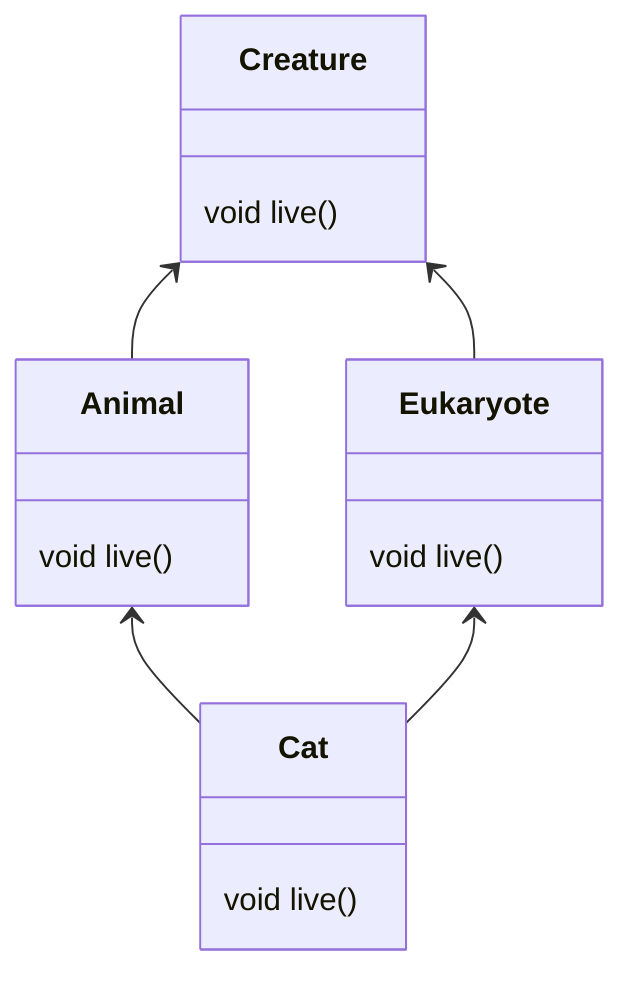

## Task1

Q: java并不支持多继承，这是为什么？

A: 是为了避免多继承带来的复杂性。比如这样:



此时Cat类在使用live()方法的时候，应该调用哪一个live()方法呢？Java语言为了简单，于是设计成只能单继承，使程序更不容易出现问题。不过多继承问题可以通过接口的方式间接实现。

## Task3

Q: 对几何图形进行建模并完成圆，三角形，矩形的周长，面积计算。

A: 源代码参见/task6/src文件夹。square.Main是程序入口类，square.graphic软件包使用继承的方式，square.graphic2软件包使用接口的方式。

其中，父类和接口类的名字都叫Graphic。

## Task3

Q: 说明public,private等关键词的用法并完成以下代码。

```java
public class BankAccount {
    // TODO 修改属性的可见性
    String accountNumber;
    String accountHolder;
    double balance;
    String password; // 敏感信息，需要严格保护
    
   BankAccount(String accountNumber, String accountHolder, double initialBalance, String password) {
        //TODO
    }
    
    void deposit(double amount) {
        //TODO
    }
    
    boolean withdraw(double amount, String inputPassword) {
        //TODO
    }
    
    boolean transfer(BankAccount recipient, double amount, String inputPassword) {
        //TODO
    }
    
    double getBalance() {
        //TODO
    }
    
    String getAccountInfo() {
        //TODO
    }
    // 只需修改可见性
    boolean validatePassword(String inputPassword) {
        return true;
    }
    // 只需修改可见性
   boolean validateAmount(double amount) {
        return true;
    }
}
```

A: 这个和Task5差不多？public、private等关键词是访问修饰符，能够限制代码对其的访问权限。经过这些关键词修饰后的代码的可见性如下:

| 修饰符       | 限制访问范围        |
|-----------|---------------|
| public    | 随便访问，无限制      |
| protected | 只有继承当前类等才能访问到 |
| private   | 只有自己才能访问      |

访问修饰符可以用在类本身，类中的变量和方法等。

代码的完成参见bank.BankAccount类。