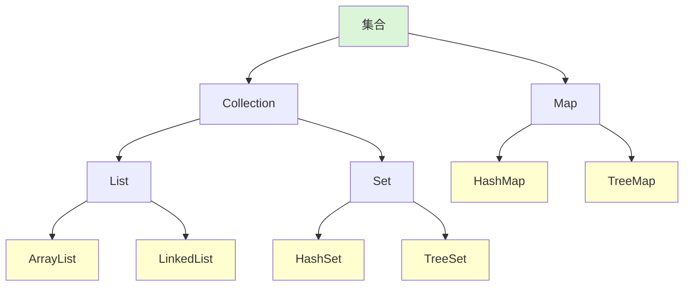
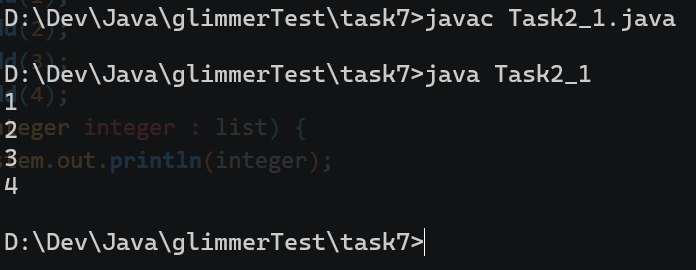
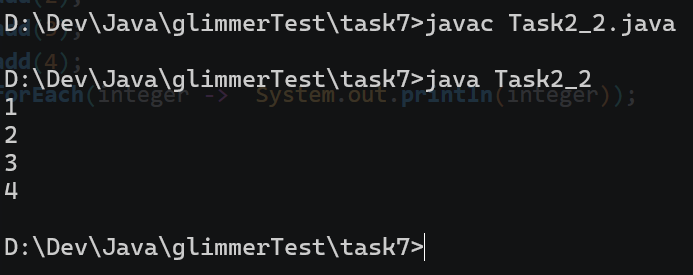
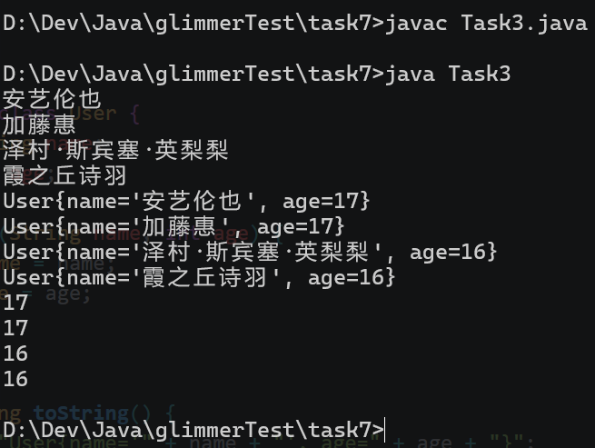
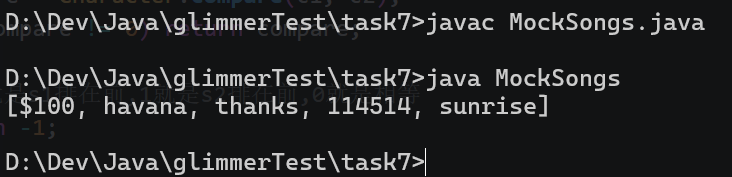

## Task1

Q: 请你简单了解一下下面的集合接口以及实现类 简单的说一说他们各自的功能 并概括一下数组与集合的区别。



A: 集合主要分为Collection和Map两类。其中Collection中每组数据仅包含一个元素，而Map每组数据包含一个键和一个值（共两个元素）。

其中Collection又分为List和Set两类。List中的元素有排列顺序且可以重复，而Set中的元素无法重复（有些Set的元素也没有排列顺序）。

后面就是他们各自的实现类了。

ArrayList基于动态数组实现，查询速度快，但插入和删除慢；LinkedList基于双向链表实现，查询速度慢，但插入和删除快。

HashSet基于哈希表，没有排列顺序，添加和查找快；TreeSet基于红黑树，有排列顺序（升序），但速度更慢。

其实，集合和数组都是存储一堆数据的容器，但是数组使用一块连续的内存空间，并使用下标访问，且数组大小一般固定；集合有多种存储结构，能提供很多功能（比如stream流操作），并且大小不固定，可以自动扩容。

它们的目标相似，只是在具体的适用范围和具体实现等处存在差别。

## Task2

Q: 请你用增强for循环遍历list中的元素 依次打印出结果 给出你的代码和运行结果截图。

A: 代码见task7/Task2_1.java，运行结果如下:



增强的for循环相当于就是遍历集合中的每一个元素并执行，并且遍历的时候集合是只读的。

Q: 什么是匿名内部类 什么是函数式接口? ( 感兴趣的同学可以去了解一下四大函数式接口 体会一下OOP和FP的区别 ) 把下面的遍历代码用lambda表达式改写 给出你的代码和运行结果截图 并总结一下lambda表达式的用法。

```java
list.forEach(new Consumer<Integer>() {
    @Override
    public void accept(Integer integer) {
        System.out.println(integer);
    }
});
```

A: 先说下内部类。顾名思义，内部类就是在类中的一个类。比如这样编写的:

```java
public class A {
    public class B{}
}
```

此时B就是一个定义在A内部的内部类。我在`/task8/Task3.java`和`/task8/Task3.java`等地方已经多次使用了内部类。当然内部类的形式不一定只能是这种形式。比如匿名内部类。

匿名内部类就是没有显式指定名字的内部类，通常用于只使用一次的类和对象。比如新建一个线程:

```java
Thread thread = new Thread(new Runnable() {
    @Override
    public void run() {
        //线程内容
    }
});
```

其中new出来的Runnable对象就是一个匿名内部类的实例对象。因为Runnable是一个接口，其中含有一个run()方法。当我实现这个Runnable的时候，就需要实现里面的run()方法。所以最后的匿名内部类就是这个样子的:

```java
Object object = new Object {
    @Override
    void method() {}
}
```

在Java8时引入了Lambda表达式和函数式接口。函数式接口就是只定义了一个方法的接口，且有一个可选的注解`@FunctionalInterface`。比如上面的Runnable就是一个函数式接口。通过Lambda表达式和函数式接口，新建线程就可以这么写:

```java
Thread thread = new Thread(() -> {
    //线程内容
});
```

现在的代码比起上面匿名内部类的代码更简洁了。

四大函数式接口如下:

- Function<T, R>
  - IO：一个输入，一个输出。
  - 方法：R apply(T t)
```java
Function<Character, Character> toUpperCase = c -> toString().toUpperCase().toCharArray()[0];
Character upper = strToLen.apply('a'); //A
```
- Consumer<T>
  - IO：只有一个输入。
  - 方法：void accept(T t)
```java
Consumer<String> printer = s -> System.out.println("Hello " + s);
printer.accept("World"); //输出Hello World
```
- Supplier<T>
  - IO：只有一个输出。
  - 方法：T get()
```java
Supplier<Double> random = () -> Math.random();
System.out.println(random.get()); //0.123456...
```
- Predicate<T>
  - IO：一个输入，一个boolean输出。
  - 方法：boolean test(T t)
```java
Predicate<Integer> isZero = n -> n == 0;
boolean a = isZero.test(0); //true
boolean b = isZero.test(1); //false
```

看得出来，面向对象编程更看重对象这一形式，而函数式编程更看重函数这一形式。面向对象能更好的建模，而函数式能够更好的处理一些事物。

所以改写之后的代码见task7/Task2_2.java，运行结果如下:



## Task3

Q: 请你完成下面的模拟项目

- 创建一个泛型接口 该接口是一个仓库 要求能够储存任何类型的数据 ( 使用泛型 )
```java
public interface Repository
```
- 这个接口内有两个方法 save( ) 方法用于向仓库中添加数据 getById( ) 方法用来根据id获取数据
- 创建MyRepository类 实现上面的接口 完成上述两个方法的具体实现 ( 注意 id是整数类型 从0开始自增 是数据的唯一标识 )
- 提示: 可以使用hashMap
```java
public class MyRepository
```
给出下述User类
```java
public class User {
    private String name;
    private int age;

    public User(String name, int age) {
        this.name = name;
        this.age = age;
    }

    @Override
    public String toString() {
        return "User{name='" + name + "', age=" + age + "}";
    }
}
```
- 要求分别在你的MyRepository储存String User Integer类型的三组数据 并调用你写的遍历方法 在main函数中打印出仓库中所有元素的内容 给出你的完整代码 以及输出截图

A: 代码见task7/Task3.java（使用内部类），输出如下:



实现也比较简单，一个泛型接口和一个泛型实现类，其中的forEach()方法实际上使用的是HashMap的forEach()方法。

对于main函数中使用forEach()时使用了方法引用，因为该方法的实现实际上使用了Consumer（四大函数式接口之一），并且方法的签名和System.out.println()函数的签名能够吻合，所以直接使用方法引用更为简洁。

方法引用的写法常见的有这几个:

- 对象::实例方法
- 类::静态方法
- 类::实例方法

此处的System.out::println属于第一种。System.out是一个PrintStream的实例。

## Task4

Q: 给出下面模拟案例的代码和运行结果截图。

假设你现在是一名负责管理酒吧点唱机的程序员，你的任务是负责将收到的歌曲数据进行排序，其他人会负责将数据封装到一个List中。而你现在有一个模拟类来测试你的代码：

```java
public class MockSongs {
    public static List<String> getSongStrings(){
        List<String> songs = new ArrayList<>();
        //模拟将要处理的列表
        songs.add("sunrise");
        songs.add("thanks");
        songs.add("$100");
        songs.add("havana");
        songs.add("114514");
        //TODO
        //在这里完成你的代码
        //END
        return songs;
    }
}
```

要求你根据**字符串的长度**进行排序 长度短的排在前面 如果长度相同 则字母排在数字前面 数字排在其他符号前面

你可以选择下面的任意一种方法调用

```java
songs.sort();
Collections.sort();
```

重写他们的排序规则即可 使用匿名内部类或lambda表达式均可 这道题是对上面知识点的巩固。

A: 代码见task7/MockSongs.java，运行截图如下:



其中主要的代码逻辑都写在里面了。如果字符串长度相等，主要是逐个字符比较字符的类别，再通过Character.compare()方法进行比较。

最下面的main方法用于快速测试。