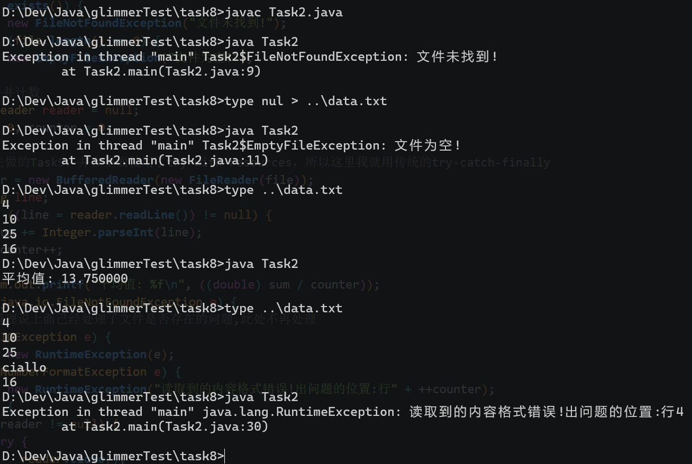
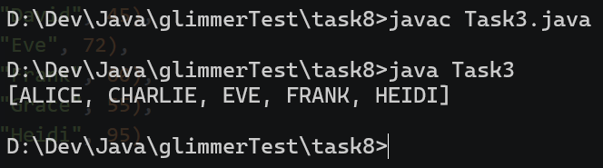

## Task1

Q: 请你简单概述一下Error与Exception的区别 当发生Exception和Error时 程序的处理态度分别应该是什么?

A: 程序运行的时候如果出现预料之外的问题，比如列举的文件不存在、网络问题、0作为除数等，这些都是程序功能上出现的问题，程序员可以通过写相应的代码来处理这些情况并使程序恢复正常运行。此时程序遇到问题会抛出Exception。

但是Java程序一般运行在JVM之上，一般无法处理较为底层的、系统的问题。比如说JVM会自动管理内存，但是发生了内存溢出；又或者是堆栈溢出等，这些一般都不能通过Java代码来使得程序正常运行，此时程序遇到问题就会抛出Error。

根据上面的解释，当发生Exception时程序应该主动捕获并处理这些问题，而Error发生时程序一般会停止运行，需要程序员主动去排查问题（而不是试图通过Java程序来解决）。

不过实际上程序绝大多数情况下只会遇到Exception类型的问题，Error类型的问题较少遇到。

Q: 你知道这两种异常(运行时异常/Unchecked Exception、Checked Exception)有什么区别吗 他们发生的原因分别是什么?

A: 个人认为最大的区别是运行时异常可以不需要捕获，而Checked Exception需要显式地捕获......不过在可能发生Exception的时候都建议使用try-catch捕获问题，使程序更加严谨。

运行时异常主要是因为代码逻辑的问题等，比如数组越界，未初始化对象就使用其实例方法......而Checked Exception大多数是由于外部环境引发的问题，比如网络错误等。这些问题Java程序不太能够直接通过代码修复这些问题，但是编译器显式要求你try-catch来让你写更严谨的代码，来处理所有可能发生的情况。

## Task2

Q: 编写一个Java程序，要求完成以下功能：

1. 读取文件: 在当前目录下，从一个文本文件中读取内容。假设文件名为`data.txt`，其中每一行包含一个整数。
2. 数据处理: 计算这些整数的平均值。
3. 异常处理
    - 如果文件不存在，抛出自定义异常`FileNotFoundException`，提示文件未找到。
    - 如果文件为空，抛出自定义异常`EmptyFileException`，提示文件为空。
    - 如果文件中包含无法解析为整数的内容，捕获`NumberFormatException`，并提示读取到的内容格式错误。
    - 最后，使用`finally`块确保文件资源被正确关闭。
要求：
- 创建自定义异常类`EmptyFileException`。
- 使用`try-with-resources`语句或者`finally`语句来管理文件的读取。
- 捕获并处理可能发生的所有异常，并给出相应的提示信息。
提示：
- 使用`BufferedReader`来读取文件内容。
- 计算平均值时，可以在读取数据的同时进行累计和计数。

A: 程序源代码见task8/Task2.java。程序的运行结果如下:



我使用了BufferReader来逐行读取文件内容，并使用`Integer.parseInt()`方法将文件中的字符串转换为int类型并相加。两个自定义的Exception是使用内部类的方式创建的。

在命令行中，我使用`type`命令创建文件、查看文件内容。

使用finally块时，可能需要检查目标对象是否被实例化，避免空指针错误。

## Task3

Q:  尝试执行下面代码 会得到什么结果? 这和你预想的一样吗? 为什么会出现这种结果?

```java
List<String> strings = List.of("I", "am", "a", "list", "of", "Strings");
//获取stream流
Stream<String> stream = strings.stream();
//调用中间方法
Stream<String> limit = stream.limit(4);
//最后我们打印结果
System.out.println("limit = " + limit);
```

A: 执行代码后会得到如下结果:

```bash
limit = java.util.stream.SliceOps$1@7699a589
```

这和我们的期望不一样。主要是因为打印的时候直接使用limit对象，如果直接打印此对象的话，实际上会调用这个对象的toString()方法。不过可惜的是，Stream类并没有重写这个方法，导致实际上调用的是Object类的toString方法。根据Object类的toString方法的实现来看，会得到这样的结果也就在意料之中了。

如果想改成我们期望的结果，可以把最后一行改成`System.out.println("limit = " + limit.toList());`。

Q: 完成下述题目。

- 定义一个学生类

```java
public class Student {
    String name;
    int score;
    //以上两个变量的setter和getter省略
    
    public Student(String name, int score) {
        this.name = name;
        this.score = score;
    }
}
```

- 初始代码

```java
public class Main {

    public static void main(String[] args) {
        // 测试数据：学生列表
        List<Student> students = Arrays.asList(
                new Student("Alice", 85),
                new Student("Bob", 58),
                new Student("Charlie", 90),
                new Student("David", 45),
                new Student("Eve", 72),
                new Student("Frank", 60),
                new Student("Grace", 55),
                new Student("Heidi", 95)
        );

        // 请在这里补充代码，完成以下任务：
        // 1. 过滤分数≥60的学生
        // 2. 姓名转换成大写
        // 3. 按姓名字母顺序排序
        // 4. 收集成 List<String> 返回并打印

        // --- 你的代码开始 ---

        List<String> passingStudents = students.stream()
        // TODO: 补充流操作链

        // --- 你的代码结束 ---

        // 打印结果
        System.out.println(passingStudents);
    }
}
```

A: 代码见task8/Task3.java。代码运行结果:



程序主要对流使用了filter()方法筛选分数>=60的学生，再通过map()方法创建一个新的只含姓名的List，再通过sorted()方法进行排序。

流的方法主要是链式调用，就像StringBuilder的append()方法一样。这样的模式在工厂模式的设计模式下也有使用。